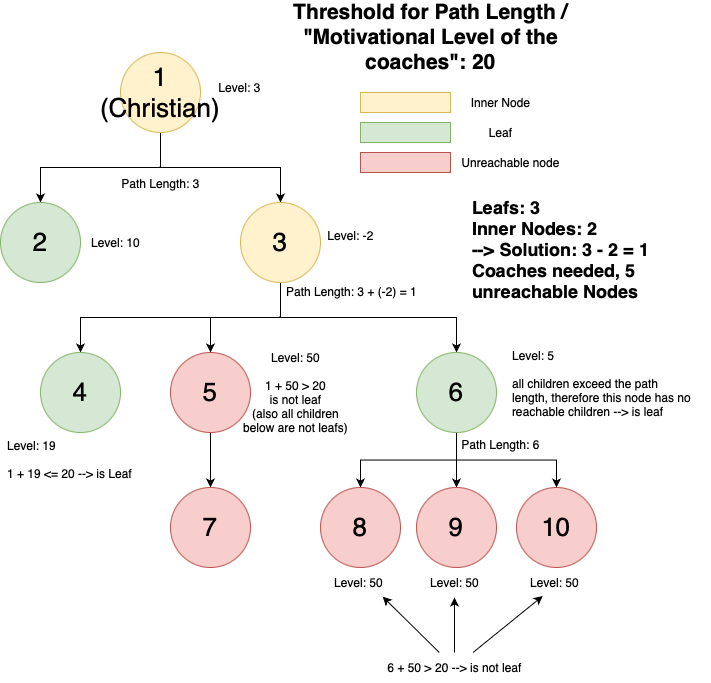

# Motivation

The problem is about finding the path coverage of the tree. The problem should find the number of nodes, whos path lengths exceed the given threshold. This node and all its decendants are marked unreachable.

## Solution Idea

> 1. Mark each node as reachable or unreachable (nodes, that exceed the allowed path length).
>    - _The number of unreachable nodes is the second part of the solution_.
>    - Also nodes, that have an unreachable parent are themselves unreachable, even if they do not exceed the path length.
> 2. Find all leafs of the tree (can be done as part of step 1). 
>    - A leaf is a node, that has no reachable children
>    - Note, that this can also be a node, that is traditionally considered an inner node.
> 3. Traverse the tree bottom-up:
>    - The number of coaches a node needs is defined by `max(1, #(reachable_children) - 1)`
>    - That means, that there is one path for each reachable child.
>    - Due to the condition, that a boss supports the coaches, having the same motivational level, we need to subtract one.
>    - Also, we always need at least one coach for each node.

## DP Solution 

To implement the above idea, a DP can be applied. In a very simple fashion, first find all children, that do not exceed the path length, followed by applying the DP structure on the rest of the tree:

> 1. Recursively find all unreachable nodes with the following pseudocode:
>    ```
>    bool mark_reachable(Tree t, Employee e, int path_length) {
>       if (path_length + e.weight > threshold) {
>           // All unreached employees are implicitly marked
>           // as unreachable.
>           return false
>       }
>    
>       e.reachable = true
>       for (Employee subordinate : t[e]) {
>           mark_reachable(
>               t, subordinate, path_length + e.weight
>           )
>       }
>    
>       return true
>    }
>    ```
> 2. Work in bottom-up fashion in tree, starting at the leafs:
>    ```
>    dp[e] = max(1, #(reachable children) - 1)
>    ```
> 3. The solution will be found at Christian: `print(dp[1])`

In this solution, we have to iterate once more over the tree, which is not absolutely necessary, but still a viable solution.

## Example Problem

Let's have a look at the following problem, solved with the simple linear solution:

