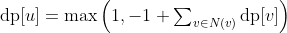

# Motivation

The problem is about finding the path coverage of the tree. The problem should find the number of nodes, whos path lengths exceed the given threshold (including all its decendants). Also, it requires to find the number of paths to leafs.

## Solution Idea

> 1. Find all nodes, that where any parent (direct or in-direct) exceed the threshold, by traversion all paths top-down.
> 2. Traverse the tree bottom-up and apply a DP structure, where:
>
>      
>

## DP Solution 

> 1. Recursively find all unreachable nodes with the following pseudocode:
>    ```
>    bool mark_reachable(Tree t, Employee e, int path_length) {
>       if (path_length + e.weight > threshold) {
>           // All unreached employees are implicitly marked
>           // as unreachable.
>           return false
>       }
>    
>       e.reachable = true
>       for (Employee subordinate : t[e]) {
>           mark_reachable(
>               t, subordinate, path_length + e.weight
>           )
>       }
>    
>       return true
>    }
>    ```
> 2. Work in bottom-up fashion in tree, starting at the leafs:
>    ```
>    dp[e] = max(1, #(reachable children) - 1)
>    ```
> 3. The solution will be found at Christian: `print(dp[1])`

In this solution, we have to iterate once more over the tree, which is not absolutely necessary, but still a viable solution.

## Example Problem

Let's have a look at the following problem, solved with the simple linear solution:

